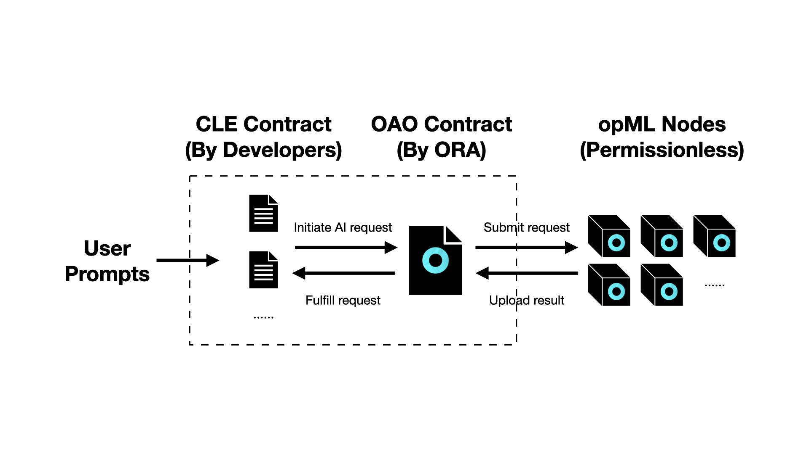

# AI Oracle

CLE in AI Oracle defines the computation and model of Ora AI Oracle / opML nodes, including machine learning inference compute.

<figure><figcaption></figcaption></figure>

Smart contract developers can build their own CLE contract to integrate with OAO contract, so that they can use AI onchain.
