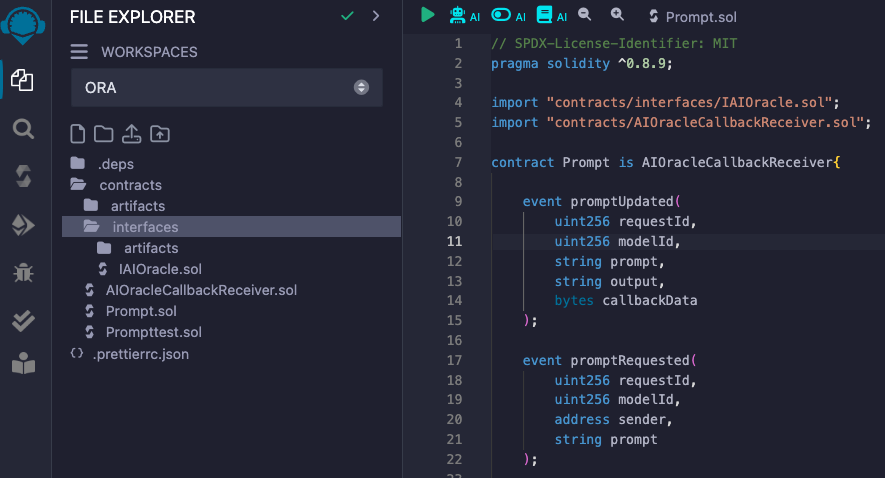
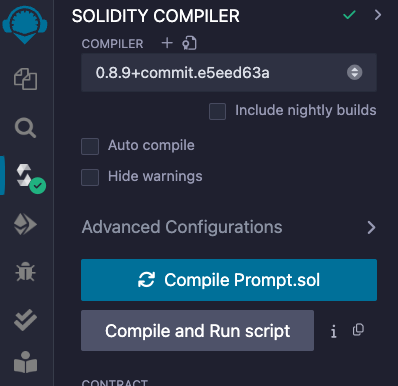

# Interaction With OAO Tutorial

 This tutorial will help you understand the structure of OAO, guide you through the process of building a simple Prompt contract that interacts with OAO.
We will implement the contract step by step. The final version of the code can be found here: [branch with the final version].
At the end we will deploy the contract to the blockchain network and interact with it.

## Learning Objectives
- Setup development environment
- Understand the project setup and template repository structure
- Learn how to interact with the OAO and build an AI powered smart contract

## Prerequisites
To follow this tutorial you need to have [Foundry](https://book.getfoundry.sh/getting-started/installation) and [git](https://git-scm.com/book/en/v2/Getting-Started-Installing-Git) installed.

## Setup
1. Clone template repository
```
Git clone [template_repo]
```
2. Move into the cloned repository
```
cd  [template_repo]
```
3. Copy .env.example, rename it to .env and add values to the env variables
```
cp .env.example .env
```

## Creating Prompt contract
### Import dependencies
At the beginning we need to import several dependencies which our smart contract will use.
```javascript
import "../interfaces/IAIOracle.sol";
import "../AIOracleCallbackReceiver.sol";
```
**IAIOracle** - interface that defines a `requestCallback` method that needs to be implemented in the Prompt contract <br/>
**AIOracleCallbackReceiver** - an abstract contract that contains an instance of AIOracle and implements a callback method that needs to be overridden in the Prompt contract

### Write the code

Implement the constructor, which accepts the address of the deployed AIOracle contract.
```c++
constructor(IAIOracle _aiOracle) AIOracleCallbackReceiver(_aiOracle){}
```
Now let’s define a method that will interact with the OAO. A user will need to provide the id of the model to be used and the input prompt data.
```javascript
function calculateAIResult(uint256 modelId, string calldata prompt) payable external {
    bytes memory input = bytes(prompt);
    uint256 requestId = aiOracle.requestCallback{value: msg.value}(
        modelId, input, address(this), callbackGasLimit[modelId], ""
    )
}
```
- convert input to bytes
- Call the requestCallback function with the following parameters: <br/>
	**modelId** - id of the AI model that is used <br/>
	**input** - the prompt that user entered <br/>
    **address(this)** - the address of the contract that will receive the callback from OAO. In this case Prompt contract itself will receive the callback. <br/>
    **callbackGasLimit[modelId]** - the callback gas limit (to be implemented) <br/>
    **""** - callback data that will be executed during the callback. In this case it is empty.

Next step is to define the mapping that keeps track of the callback gas limit for each model and set the initial values inside the constructor. We’ll also define a modifier so that only the contract owner can change these values.

```javascript
address owner;

modifier onlyOwner() {
	require(msg.sender == owner, "Only owner");
	_;
}

mapping(uint256 => uint64) public callbackGasLimit;

function setCallbackGasLimit(uint256 modelId, uint64 gasLimit) external onlyOwner {
    callbackGasLimit[modelId] = gasLimit;
}

constructor(IAIOracle _aiOracle) AIOracleCallbackReceiver(_aiOracle) {
    owner = msg.sender;
	callbackGasLimit[50] = 500_000;
	callbackGasLimit[11] = 5_000_000;
    callbackGasLimit[9] = 5_000_000;
}
```

We want to store all the requests that happened, so we create a data structure for the request data and the mapping between requestId and the request data.

```javascript
event promptRequest(
    uint256 requestId,
    address sender, 
    uint256 modelId,
    string prompt
);

struct AIOracleRequest {
    address sender;
    uint256 modelId;
    bytes input;
    bytes output;
}

mapping(uint256 => AIOracleRequest) public requests;

function calculateAIResult(uint256 modelId, string calldata prompt) payable external {
    bytes memory input = bytes(prompt);
    uint256 requestId = aiOracle.requestCallback{value: msg.value}(
        modelId, input, address(this), callbackGasLimit[modelId], ""
    );
    AIOracleRequest storage request = requests[requestId];
    request.input = input;
    request.sender = msg.sender;
    request.modelId = modelId;
    emit promptRequest(requestId, msg.sender, modelId, prompt);
}
```
In the code snippet above we added prompt, sender and the modelId to the request and also emitted an event. <br/>
Now that we implemented a method for interaction with the OAO, let's define a callback that will be invoked by the OAO after the computation of the result.

```javascript
event promptsUpdated(
    uint256 requestId,
    uint256 modelId,
    string input,
    string output,
    bytes callbackData
);

mapping(uint256 => mapping(string => string)) public prompts;

function getAIResult(uint256 modelId, string calldata prompt) external view returns (string memory) {
    return prompts[modelId][prompt];
}

function aiOracleCallback(uint256 requestId, bytes calldata output, bytes calldata callbackData) external override onlyAIOracleCallback() {
    AIOracleRequest storage request = requests[requestId];
    require(request.sender != address(0), "request does not exist");
    request.output = output;
    prompts[request.modelId][string(request.input)] = string(output);
    emit promptsUpdated(requestId, request.modelId, string(request.input), string(output), callbackData);
}
```
We've overriden the callback function from the `AIOracleCallbackReceiver.sol`. It's important to use the modifier, so that only OAO can callback into our contract. <br/>
- First we check if the request with provided id exists. If it does we add the output value to the request. <br/>
- Then we can define `prompts` mapping that stores all the prompts and outputs for each model that we use. <br/>
- At the end we emit an event that the prompt has been updated. <br/>

Notice that this function takes callbackData as the last parameter. This parameter can be used to execute arbitrary logic during the callback. It is passed during `requestCallback` call. In our simple example, we left it empty. <br/> </br>
Finally let's add the method that will estimate the fee for the callback call.
```javascript
function estimateFee(uint256 modelId) public view returns (uint256) {
    return aiOracle.estimateFee(modelId, callbackGasLimit[modelId]);
}
```

With this we finished with the source code for our contract. The final version should look like this:
```javascript
// SPDX-License-Identifier: MIT
pragma solidity ^0.8.9;

import "./interfaces/IAIOracle.sol";
import "./AIOracleCallbackReceiver.sol";

contract Prompt is AIOracleCallbackReceiver {
    
    event promptsUpdated(
        uint256 requestId,
        uint256 modelId,
        string input,
        string output,
        bytes callbackData
    );

    event promptRequest(
        uint256 requestId,
        address sender, 
        uint256 modelId,
        string prompt
    );

    struct AIOracleRequest {
        address sender;
        uint256 modelId;
        bytes input;
        bytes output;
    }

    address owner;

    modifier onlyOwner() {
        require(msg.sender == owner, "Only owner");
        _;
    }

    mapping(uint256 => AIOracleRequest) public requests;

    mapping(uint256 => uint64) public callbackGasLimit;

    constructor(IAIOracle _aiOracle) AIOracleCallbackReceiver(_aiOracle) {
        owner = msg.sender;
        callbackGasLimit[50] = 500_000; // Stable-Diffusion
        callbackGasLimit[11] = 5_000_000; // llama
        callbackGasLimit[9] = 5_000_000; // grok
    }

    function setCallbackGasLimit(uint256 modelId, uint64 gasLimit) external onlyOwner {
        callbackGasLimit[modelId] = gasLimit;
    }

    mapping(uint256 => mapping(string => string)) public prompts;

    function getAIResult(uint256 modelId, string calldata prompt) external view returns (string memory) {
        return prompts[modelId][prompt];
    }

    function aiOracleCallback(uint256 requestId, bytes calldata output, bytes calldata callbackData) external override onlyAIOracleCallback() {
        AIOracleRequest storage request = requests[requestId];
        require(request.sender != address(0), "request does not exist");
        request.output = output;
        prompts[request.modelId][string(request.input)] = string(output);
        emit promptsUpdated(requestId, request.modelId, string(request.input), string(output), callbackData);
    }

    function estimateFee(uint256 modelId) public view returns (uint256) {
        return aiOracle.estimateFee(modelId, callbackGasLimit[modelId]);
    }

    function calculateAIResult(uint256 modelId, string calldata prompt) payable external {
        bytes memory input = bytes(prompt);
        uint256 requestId = aiOracle.requestCallback{value: msg.value}(
            modelId, input, address(this), callbackGasLimit[modelId], ""
        );
        AIOracleRequest storage request = requests[requestId];
        request.input = input;
        request.sender = msg.sender;
        request.modelId = modelId;
        emit promptRequest(requestId, msg.sender, modelId, prompt);
    }
}
```

## Deployment and interaction with the contract

1. Install the browser wallet if you haven't already (eg. Metamask)
2. Open your solidity development environtment. We'll use [Remix IDE](https://remix.ethereum.org/).
3. Copy the contract along with necessary dependencies to Remix.
    <div>
        
    </div>
4. Choose the solidity compiler version and compile the contract to the bytecode
    <div>
        
    </div>
5.  Deploy the compiled bytecode
    <br/>Once we compiled our contract we can deploy it.
    1. First go to the wallet and choose the blockchain network for the deployment.
    2. To deploy the Prompt contract we need to provide the address of already deployed AIOracle contract. You can find this address on the [reference page](https://docs.ora.io/doc/cle/ai-oracle/reference). We are looking for OAO_PROXY address.
        <div>
            
        </div>
    3. Deploy the contract by signing the transaction in the wallet.
 6. Once the contract is deployed, you can interact with it. 
    <br/> Remix supports API for interaction, but you can also use blockchain explorers like [Etherscan](https://etherscan.io/). <br/>
    Let's use Stable Diffusion model (id = 50). Call `estimateFee` method to calculate fee for the callback.
    <div>
        
    </div>
    Then request AI inference from OAO by calling `calculateAIResult` method. Pass the model id and the prompt for the image generation. Remember to pass estimated fee as a value for the transaction.
    <div>
        
    </div>
    After the transaction is executed, and the OAO calculates result, you can check it by calling prompts method. Simply input model id and the prompt you used for image generation. In the case of Stable Diffusion, the output will be a CID (content identifier on ipfs).
    <div>
        
    </div>

    ## Conclusion
    In this tutorial we covered step by step writing of a solidity smart contract that interacts with ORA's On-chain AI Oracle. Then we compiled and deployed our contract to the live network and interacted with it. In the next tutorial, we will extend the functionality of the Prompt contract to support AI generated NFT collections.
    