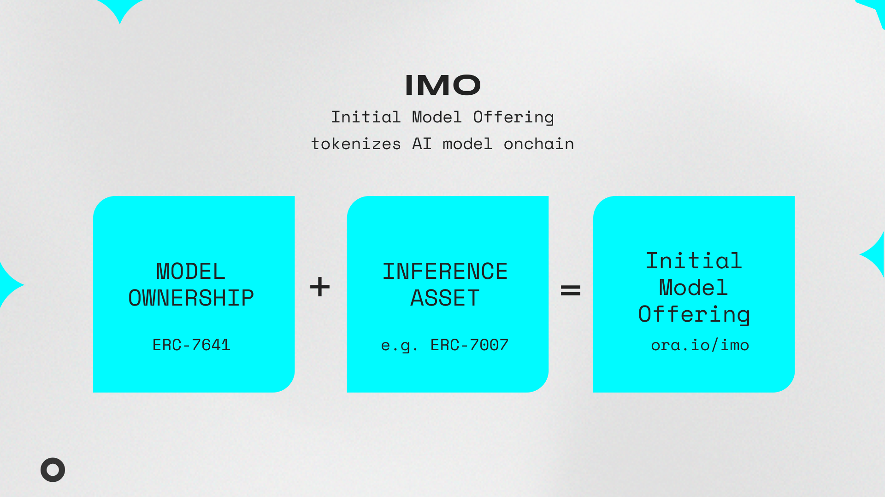

# IMO Overview

Open-source AI models are vital for fostering innovation and collaboration. However, sustaining these models financially remains a significant challenge. As a result, the AI industry is currently dominated by closed-source, for-profit companies.

To address this, ORA introduces the **Initial Model Offering (IMO)**, a mechanism that tokenizes AI models onchain. IMOs enable open-source AI model developers to secure funding and build in public, fostering a more collaborative and innovative AI ecosystem.

<figure><figcaption></figcaption></figure>

### **What is an IMO?**

An Initial Model Offering (IMO) involves the issuance of an **ERC-7641 Intrinsic RevShare Token** for an AI model to represent its long-term value. By holding IMO tokens, anyone can become a part of the AI model's ecosystem and contribute to its development and sustainability while capturing a percentage of fees incurred by users during inference.

<figure><figcaption></figcaption></figure>

### **Key Benefits**

* **For AI Model Developers**: Provides sustainable funding for open-source development.
* **For Ecosystems**: Aligns values and incentives for distribution and ongoing contribution.
* **For Token Holders**: Enables capturing the value of AI models onchain through revenue sharing.

## **How IMOs Work**

1. **Tokenization**: An AI model is tokenized into ERC-7641 tokens.
2. **Value Generation**: The AI model generates fees through onchain usage and AI-generated content.
3. **Value Distribution**: The token mechanism facilitates the distribution of fees within the ecosystem transparently and proportionally.
4. **Governance**: Token holders can assist with model ecosystem development through voting on funding and grants.

## **The IMO Mechanism**

An IMO combines two core components:

1. **Verifiable Onchain AI Models**
2. **ERC-7641 Intrinsic RevShare Token**

<figure><figcaption></figcaption></figure>

### **1. Verifiable Onchain AI Models**

To ensure the token mechanics are a closed loop, the model uses verifiable onchain inferences. This is achieved through:

* [**opML (Optimistic Machine Learning)**](https://docs.ora.io/doc/the-ora-network/fraud-proof-virtual-machine-fpvm-and-frameworks/opml): Leverages fraud proofs to ensure model correctness and overcome the computational limitations of blockchains.
* [**AI Oracle**](https://docs.ora.io/doc/the-ora-network/ai-oracle-network): The practical implementation of opML, enabling AI models to operate onchain through the ORA Network.

By adopting opML and our AI Oracle, IMOs ensure practicality and performance in running AI models onchain while simultaneously providing a mechanism to capture fees when that model’s outputs are ingested by other smart contracts.

### **2. ERC-7641 Intrinsic RevShare Token**

The **ERC-7641 Intrinsic RevShare Token** standardizes interaction and revenue sharing logic with the AI model. Participants may benefit from mechanisms such as:

* **Model Usage Fees**: Each onchain use of the AI model involves a fee managed through the token mechanism. This fee is distributed proportionally to token holders.
* **AI-Generated Content Revenue**: Outputs generated by the AI model (e.g. NFTs from an image generator model) may carry royalty and mint fees. By using additional standards such as **ERC-7007**, these fees can also be captured and distributed to token holders.

## **Additional Resources**

* **ETHDenver Talk**: [AI Isn't Evil and Smart Contract Proves It](https://www.youtube.com/watch?v=6fujouJ26n8)
* **Sample ERC-7641 Implementation**: [GitHub Repository](https://github.com/ora-io/imo-token-contract)
* **ERC-7007:** [**Verifiable AI-Generated Content Token**](https://app.gitbook.com/o/rWlGmOlOvnmpt08RvxKm/s/llyHj70MVMOxu2WT7tZv/\~/changes/263/resources/erc-7007-verifiable-ai-generated-content-token)
* **ERC-7641:** [**Intrinsic RevShare Token**](erc-7641-intrinsic-revshare-token.md)

***

_For questions or contributions to the IMO ecosystem,_ [_please contact ORA._](broken-reference)

