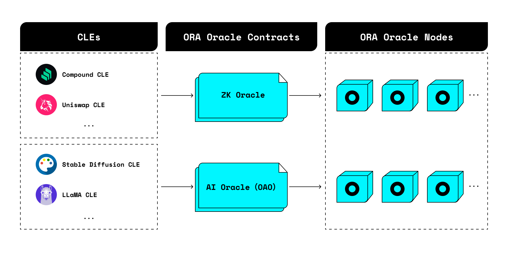

# Introduction


If you want to build with onchain AI.

ORA offers:

* zkML of [keras2circom](https://github.com/ora-io/keras2circom) (the most battle-tested and performant zkML framework)
* [opML](https://arxiv.org/abs/2401.17555) of [AI Oracle](./) (run huge model like LlaMA2-7B and Stable Diffusion now)
* zk+opML with [opp/ai](https://arxiv.org/abs/2402.15006) (futuristic onchain AI fuses zkML's privacy and opML's scalability)


[Onchain AI Oracle (OAO)](https://blockworks.co/news/ora-on-chain-oracle-ethereum) is the ORA's verifiable and decentralized AI oracle.

OAO integrates different AI models onchain in ORA AI Oracle nodes.

<figure><figcaption></figcaption></figure>

Smart contract developers can build their own contract based on different models in AI Oracle, to interact with OAO contract, so that they can use AI onchain.

<figure><figcaption></figcaption></figure>

Some of the example use cases are: AIGC NFT with ERC-7007, zkKYC using facial recognition based on ML, onchain AI games (e.g. Dungeon and Dragons), prediction market with ML, content authenticity (deepfake verifier), compliant programmable privacy, prompt marketplace, reputation/credit scoring... For example integrations and ideas to build, see [awesome-ora](https://github.com/ora-io/awesome-ora#-ai-oracle-cle-ecosystem).
