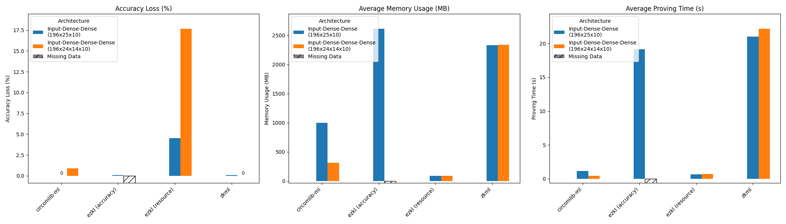

# zkML

[Keras2circom](https://github.com/ora-io/keras2circom) is the first advanced zkML framework that is battle-tested.

From [a recent benchmark](https://hackmd.io/\_vrpMIusSEaROYUU7-Shaw) by Ethereum Foundation ESP Grant Proposal \[FY23-1290] on leading zkML frameworks, keras2circom and its underlying [circomlib-ml](https://github.com/socathie/circomlib-ml) are proven to be performant than other frameworks.

<figure><figcaption></figcaption></figure>

Besides being production-ready, circomlib-ml has rich ecosystem:

* [nova-ml](https://github.com/privacy-scaling-explorations/nova-ml) by Ethereum Foundation
* [zator](https://github.com/lyronctk/zator)
* [ZKaggle](https://github.com/z-kaggle/ZKaggle)
* [Picus](https://github.com/chyanju/Picus)
