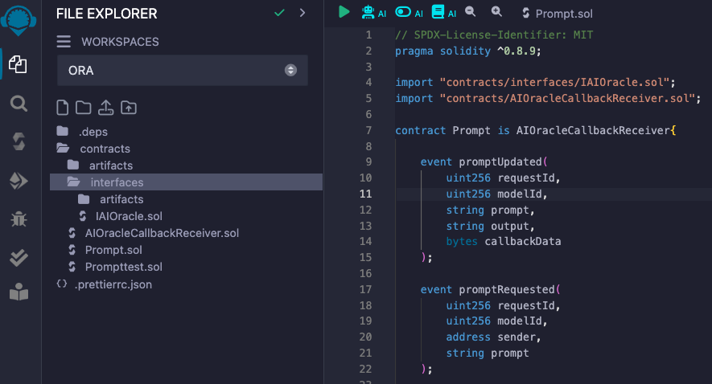
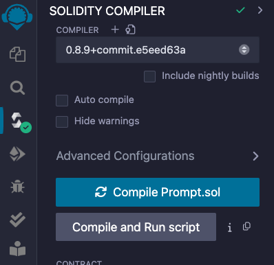
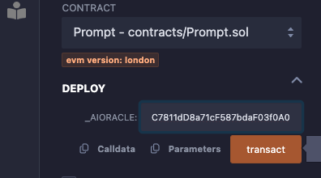

# Build with AI Oracle

This tutorial will help you understand the structure of the AI Oracle,  guide you through the process of building a simple Prompt contract that interacts with the ORA network.&#x20;

If you prefer a video version of the tutorial, check it [here](https://www.youtube.com/watch?v=8fcJbeKN1uM).

Final version of the code can be found [here](https://github.com/ora-io/Interaction\_With\_OAO\_Template).

### Learning Objectives

* Setup the development environment
* Understand the project setup and template repository structure
* Learn how to interact with the AI Oracle and build an AI powered smart contract

### Prerequisites

To follow this tutorial you need to have [Foundry](https://book.getfoundry.sh/getting-started/installation) and [git](https://git-scm.com/book/en/v2/Getting-Started-Installing-Git) installed.

### Setup

1. Clone template repository and install submodules

```
git clone -b OAO_interaction_tutorial git@github.com:ora-io/Interaction_With_OAO_Template.git --recursive
```

2. Move into the cloned repository

```
cd Interaction_With_OAO_Template
```

3. Copy .env.example, rename it to .env. We will need these env variables later for the deployment and testing. You can leave them empty for now.

```
cp .env.example .env
```

4. Install foundry dependencies

```
forge install
```

### Creating Prompt contract

#### 1. Import dependencies

At the beginning we need to import several dependencies which our smart contract will use.

```solidity
import "OAO/contracts/interfaces/IAIOracle.sol";
import "OAO/contracts/AIOracleCallbackReceiver.sol";
```

**IAIOracle** - interface that defines a `requestCallback` method that needs to be implemented in the Prompt contract\
**AIOracleCallbackReceiver** - an abstract contract that contains an instance of AIOracle and implements a callback method that needs to be overridden in the Prompt contract

#### 2. Write the code

We'll start by implementing the constructor, which accepts the address of the deployed AIOracle contract.

```solidity
constructor(IAIOracle _aiOracle) AIOracleCallbackReceiver(_aiOracle){}
```

Now let’s define a method that will interact with the AI Oracle. This method requires 2 parameters, id of the model and input prompt data. It also needs to be payable, because a user needs to pass the fee for the callback execution.

```solidity
function calculateAIResult(uint256 modelId, string calldata prompt) payable external {
    bytes memory input = bytes(prompt);
    bytes memory callbackData = bytes("");
    address callbackAddress = address(this);
    uint256 requestId = aiOracle.requestCallback{value: msg.value}(
        modelId, input, callbackAddress, callbackGasLimit[modelId], callbackData
    );
}
```

In the code above we do the following:

1. Convert input to bytes
2. Call the requestCallback function with the following parameters:
   * **modelId**: ID of the AI model in use.
   * **input**: User-provided prompt.
   * **callbackAddress**: The address of the contract that will receive AI Oracle's callback.
   * **callbackGasLimit\[modelId]**: Maximum amount of that that can be spent on the callback, yet to be defined.
   * **callbackData**: Callback data that is used in the callback.

Next step is to define the mapping that keeps track of the callback gas limit for each model and set the initial values inside the constructor. We’ll also define a modifier so that only the contract owner can change these values.

```solidity
address owner;

modifier onlyOwner() {
    require(msg.sender == owner, "Only owner");
    _;
}

mapping(uint256 => uint64) public callbackGasLimit;

function setCallbackGasLimit(uint256 modelId, uint64 gasLimit) external onlyOwner {
    callbackGasLimit[modelId] = gasLimit;
}

constructor(IAIOracle _aiOracle) AIOracleCallbackReceiver(_aiOracle) {
    owner = msg.sender;
    callbackGasLimit[50] = 500_000; // Stable-Diffusion
    callbackGasLimit[11] = 5_000_000; // Llama
}
```

We want to store all the requests that occurred, so we create a data structure for the request data and the mapping between requestId and the request data.

```solidity
event promptRequest(
    uint256 requestId,
    address sender, 
    uint256 modelId,
    string prompt
);

struct AIOracleRequest {
    address sender;
    uint256 modelId;
    bytes input;
    bytes output;
}

mapping(uint256 => AIOracleRequest) public requests;

function calculateAIResult(uint256 modelId, string calldata prompt) payable external {
    bytes memory input = bytes(prompt);
    bytes memory callbackData = bytes("");
    address callbackAddress = address(this);
    uint256 requestId = aiOracle.requestCallback{value: msg.value}(
        modelId, input, callbackAddress, callbackGasLimit[modelId], callbackData
    );
    AIOracleRequest storage request = requests[requestId];
    request.input = input;
    request.sender = msg.sender;
    request.modelId = modelId;
    emit promptRequest(requestId, msg.sender, modelId, prompt);
}
```

In the code snippet above we added prompt, sender and the modelId to the request and also emitted an event.

Now that we implemented a method for interaction with the AI Oracle, let's define a callback that will be invoked by the AI Oracle after the computation of the result.

```solidity
event promptsUpdated(
    uint256 requestId,
    uint256 modelId,
    string input,
    string output,
    bytes callbackData
);

mapping(uint256 => mapping(string => string)) public prompts;

function getAIResult(uint256 modelId, string calldata prompt) external view returns (string memory) {
    return prompts[modelId][prompt];
}

function aiOracleCallback(uint256 requestId, bytes calldata output, bytes calldata callbackData) external override onlyAIOracleCallback() {
    AIOracleRequest storage request = requests[requestId];
    require(request.sender != address(0), "request does not exist");
    request.output = output;
    prompts[request.modelId][string(request.input)] = string(output);
    emit promptsUpdated(requestId, request.modelId, string(request.input), string(output), callbackData);
}
```

We've overridden the callback function from the `AIOracleCallbackReceiver.sol`. It is important to use the modifier, so that only AI Oracle can callback into our contract.

Function flow:

1. First we check if the request with provided id exists. If it does we add the output value to the request.
2. Then we define `prompts` mapping that stores all the prompts and outputs for each model that we use.
3. At the end we emit an event that the prompt has been updated.

Notice that this function takes callbackData as the last parameter. This parameter can be used to execute arbitrary logic during the callback. It is passed during `requestCallback` call. In our simple example, we left it empty.\
\
Finally let's add the method that will estimate the fee for the callback call.

```solidity
function estimateFee(uint256 modelId) public view returns (uint256) {
    return aiOracle.estimateFee(modelId, callbackGasLimit[modelId]);
}
```

With this, we've completed with the source code for our contract. The final version should look like this:

```solidity
// SPDX-License-Identifier: MIT
pragma solidity ^0.8.13;

import "OAO/contracts/interfaces/IAIOracle.sol";
import "OAO/contracts/AIOracleCallbackReceiver.sol";

contract Prompt is AIOracleCallbackReceiver {
    
    event promptsUpdated(
        uint256 requestId,
        uint256 modelId,
        string input,
        string output,
        bytes callbackData
    );

    event promptRequest(
        uint256 requestId,
        address sender, 
        uint256 modelId,
        string prompt
    );

    struct AIOracleRequest {
        address sender;
        uint256 modelId;
        bytes input;
        bytes output;
    }

    address owner;

    modifier onlyOwner() {
        require(msg.sender == owner, "Only owner");
        _;
    }

    mapping(uint256 => AIOracleRequest) public requests;

    mapping(uint256 => uint64) public callbackGasLimit;

    constructor(IAIOracle _aiOracle) AIOracleCallbackReceiver(_aiOracle) {
        owner = msg.sender;
        callbackGasLimit[50] = 500_000; // Stable-Diffusion
        callbackGasLimit[11] = 5_000_000; // Llama
    }

    function setCallbackGasLimit(uint256 modelId, uint64 gasLimit) external onlyOwner {
        callbackGasLimit[modelId] = gasLimit;
    }

    mapping(uint256 => mapping(string => string)) public prompts;

    function getAIResult(uint256 modelId, string calldata prompt) external view returns (string memory) {
        return prompts[modelId][prompt];
    }

    function aiOracleCallback(uint256 requestId, bytes calldata output, bytes calldata callbackData) external override onlyAIOracleCallback() {
        AIOracleRequest storage request = requests[requestId];
        require(request.sender != address(0), "request does not exist");
        request.output = output;
        prompts[request.modelId][string(request.input)] = string(output);
        emit promptsUpdated(requestId, request.modelId, string(request.input), string(output), callbackData);
    }

    function estimateFee(uint256 modelId) public view returns (uint256) {
        return aiOracle.estimateFee(modelId, callbackGasLimit[modelId]);
    }

    function calculateAIResult(uint256 modelId, string calldata prompt) payable external {
        bytes memory input = bytes(prompt);
        bytes memory callbackData = bytes("");
        address callbackAddress = address(this);
        uint256 requestId = aiOracle.requestCallback{value: msg.value}(
            modelId, input, callbackAddress, callbackGasLimit[modelId], callbackData
        );
        AIOracleRequest storage request = requests[requestId];
        request.input = input;
        request.sender = msg.sender;
        request.modelId = modelId;
        emit promptRequest(requestId, msg.sender, modelId, prompt);
    }
}
```

### Deployment and interaction with the contract

#### Foundry version

1.  Add your `PRIVATE_KEY`, `RPC_URL` and `ETHERSCAN_KEY` to .env file. Then source variables in the terminal.\


    ```shell
    source .env
    ```


2.  Create a deployment script

    Go to [Reference](references/) page and find the OAO\_PROXY address for the network you want to deploy to.

    Then open script/Prompt.s.sol and add the following code:


    ```solidity
    // SPDX-License-Identifier: MIT
    pragma solidity ^0.8.13;

    import {Script} from "forge-std/Script.sol";
    import {Prompt} from "../src/Prompt.sol";
    import {IAIOracle} from "OAO/contracts/interfaces/IAIOracle.sol";

    contract PromptScript is Script {
        address OAO_PROXY;

        function setUp() public {
            OAO_PROXY = [OAO_PROXY_address_here];
        }

        function run() public {
            uint privateKey = vm.envUint("PRIVATE_KEY");
            vm.startBroadcast(privateKey);
            new Prompt(IAIOracle(OAO_PROXY));
            vm.stopBroadcast();
        }
    }
    ```


3.  Run the deployment script\


    ```bash
    forge script script/Prompt.s.sol --rpc-url $RPC_URL --broadcast --verify --etherscan-api-key $ETHERSCAN_KEY
    ```


4.  Once the contract is deployed and verified, you can interact with it.\
    \
    Go to blockchain explorer for your chosen network (eg. [Etherscan](https://etherscan.io/)), and paste the address of the deployed Prompt contract.\


    Let's use Stable Diffusion model (id = 50) as an example.&#x20;

    1.  First call `estimateFee` method to calculate fee for the callback.\


        <div align="left">

        <figure><figcaption></figcaption></figure>

        </div>
    2.  Request the AI inference from the AI Oracle by calling _calculateAIResult_ method. Pass the model id and the prompt for the image generation. Remember to provide an estimated fee as a value for the transaction.\


        <div align="left">

        <figure><figcaption></figcaption></figure>

        </div>
    3.  After the transaction is executed, and the AI Oracle calculates the result, you can check it by calling _prompts_ method. Simply input model id and the prompt you used for image generation. In the case of Stable Diffusion, the output will be a CID (content identifier on [ipfs](https://ipfs.tech/)). To check the image go to [https://ipfs.io/ipfs/\[Replace\_your\_CID\]](https://ipfs.io/ipfs/).\


        <div align="left">

        <figure><figcaption></figcaption></figure>

        </div>

#### Remix version

1. Install the browser wallet if you haven't already (eg. Metamask)
2. Open your solidity development environment. We'll use [Remix IDE](https://remix.ethereum.org/).
3.  Copy the contract along with necessary dependencies to Remix.\


    <div align="left">

    <figure><figcaption><p>remix explorer</p></figcaption></figure>

    </div>
4.  Choose the solidity compiler version and compile the contract to the bytecode\


    <div align="left">

    <figure><figcaption><p>remix compiler</p></figcaption></figure>

    </div>
5.  Deploy the compiled bytecode\
    Once we compiled our contract, we can deploy it.

    1. First go to the wallet and choose the blockchain network for the deployment.
    2. To deploy the Prompt contract we need to provide the address of already deployed AIOracle contract. You can find this address on the [reference page](https://docs.ora.io/doc/cle/ai-oracle/reference). We are looking for OAO\_PROXY address.
    3. Deploy the contract by signing the transaction in the wallet.\


    <div align="left">

    <figure><figcaption><p>deployment</p></figcaption></figure>

    </div>
6. Once the contract is deployed, you can interact with it.\
   Remix supports API for interaction, but you can also use blockchain explorers like [Etherscan](https://etherscan.io/).\
   Let's use Stable Diffusion model (id = 50).&#x20;
   1. First call `estimateFee` method to calculate fee for the callback.\
      
   2. Then request AI inference from the AI Oracle by calling \`calculateAIResult\` method. Pass the model id and the prompt for the image generation. Remember to provide estimated fee as a value for the transaction.\
      
   3. After the transaction is executed, and the AI Oracle calculates result, you can check it by calling prompts method. Simply input model id and the prompt you used for image generation. In the case of Stable Diffusion, the output will be a CID (content identifier on [ipfs](https://ipfs.tech/)).\
      

### Conclusion

In this tutorial we covered a step by step writing of a solidity smart contract that interacts with ORA's AI Oracle. Then we compiled and deployed our contract to the live network and interacted with it. In the next tutorial, we will extend the functionality of the Prompt contract to support AI generated NFT collections.
