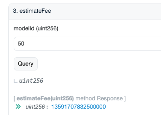

# Tora CLI - Tutorial

### **Releases:** [**https://github.com/ora-io/tora-docker-compose/releases**](https://github.com/ora-io/tora-docker-compose/releases)

### **Prerequisites**

Please confirm that your computer has Docker installed and ensure there is a smooth network connection. The installation, operation, and upgrade of Tora validator client will be based on Docker.

### **Minimal requirements**

To run a Tora validator client, your computer must have:

* Any Operating System with Docker installed.
* 1-core CPU that exceeds 8 GB RAM (12GB recommended). This configuration is sufficient to run an OpenLM model server.

💡 Set up a new fresh wallet to run the node. Do not use "everyday wallet".

💡 Please ensure that there is sufficient balance in the wallet used for `confirmation`, which can be used to pay for `transaction.Gas`.

💡 Make sure to set appropriate RAM limit in the docker engine configuration.

<figure><figcaption></figcaption></figure>

### Setup

1. Download the latest version of Tora validator client at [releases page](https://github.com/ora-io/tora-docker-compose/releases).
2.  Enter the project directory `tora-docker-compose` and write the configuration file `.env`.

    ```bash
    cd tora-docker-compose
    mv .env.example .env && vim .env
    ```

For the parameters that need to be configured in `.env`, please refer to the next subsection.

### Config

#### RPC (required)

You need to modify the following four environment variables.

* `MAINNET_WSS`
* `MAINNET_HTTP`
* `SEPOLIA_WSS`
* `SEPOLIA_HTTP`

The Tora validator client does not currently provide a default public RPC. To create your own API key, please register an provider account like the Alchemy.

```bash
MAINNET_WSS=""
MAINNET_HTTP=""
SEPOLIA_WSS=""
SEPOLIA_HTTP=""
```

#### CONFIRM\_CHAINS (required)


Currently, running multiple networks in one node is not supported.


The Tora validator client currently supports Ethereum Mainnet and Sepolia.

You need to modify the `CONFIRM_CHAINS` environment variable to select the chain you want to listen to.

This variable requires a string type, but you can listen to multiple chains at the same time by using a JSON-formatted string.

The following examples are feasible:

```bash
CONFIRM_CHAINS="mainnet"
CONFIRM_CHAINS='["mainnet"]'
CONFIRM_CHAINS='["mainnet","sepolia"]'
```

#### PRIV\_KEY (required)

You need to modify the PRIV\_KEY environment variable to set the wallet used for confirmation.

Please ensure that the wallet has enough balance to pay transaction gas.

For example:

```bash
PRIV_KEY="0x..."
```

#### CONFIRM\_MODELS (required)

The TORA validator currently supports OpenLM model.

You can modify the `CONFIRM_MODELS` environment variable to select the model you want to validate.

This variable requires a number Array type encoded in JSON.

The following example is feasible:

```bash
CONFIRM_MODELS='[13]'
```

#### CONFIRM\_USE\_CROSSCHECK (optional)

When `CONFIRM_USE_CROSSCHECK` is set to `true`, the node will periodically check if any events are missed.

If set to `false`, it will not check for misses.

The following example is feasible:

```bash
CONFIRM_USE_CROSSCHECK=true
```

#### CONFIRM\_CC\_POLLING\_INTERVAL (optional)

This environment variable is the time interval between each crosscheck.

```bash
CONFIRM_CC_POLLING_INTERVAL=3000 # 3 sec in ms
```

#### CONFIRM\_CC\_BATCH\_BLOCKS\_COUNT ( optional )

This environment variable is used to set how many blocks crosscheck checks each time. It is recommended to set a relative large block number that takes at least 1 hr to generate. &#x20;

💡 There won’t be any overlapping or missing blocks as long as this value is greater than 0, because crosschecks always start from the last checkpoint height

```bash
BATCH_BLOCKS_MAX=600 # default 600 means blocks in 2 hours on eth
```

#### CONFIRM\_TASK\_TTL ( optional )

Confirm Task will be processed within a certain period of time. After the timeout, the node will skip this Task.

```bash
CONFIRM_TASK_TTL=7200000
```

#### CONFIRM\_CC\_TTL ( optional )

This environment variable can be set to determine how often crosscheck should be performed. note that this can be safely set to a small number, since the crosschecker also waits for fulfilling the `BATCH_BLOCKS_COUNT` for each check.

```sh
CONFIRM_CC_TTL=7200000 # 2 hours in ms
```

#### TORA\_ENV ( optional )

This environment variable will affect the log level. The default is production, changing it to other values will generate more detailed logs.

```bash
TORA_ENV=production
```

#### REDIS\_TTL ( optional )

This environment variable determines the lifespan of redis connections, which is set to one day by default.

```bash
REDIS_TTL=86400000 # 1 day in ms 
```

### Start

```bash
# ./tora-docker-compose
docker compose up
```

This will start 4 docker containers:

* `ora-tora`
* `ora-redis`
* `ora-openlm`
* `diun`

### **Watch the logs**

If Docker Desktop is installed, you can view the logs by following `docker desktop - container - tora-olm`

Otherwise, you can use the following command line to view.

```bash
docker container logs ora-tora
```

### Test the Node

1. **Initialization**

After executing the command "docker compose up", the Tora validator starts the initialization process.

When you see `[confirm] [+] RPC Server running on port 5001`, it means that the Tora validator has completed initialization and everything is ready.

```bash
2024-08-22 23:05:46 ora-openlm   | Loading model into the right classes...
2024-08-22 23:05:46 ora-openlm   | Loading checkpoint from disk...
2024-08-22 23:05:46 ora-openlm   |  * Serving Flask app 'olm_server'
2024-08-22 23:05:46 ora-openlm   |  * Debug mode: off
2024-08-22 23:05:46 ora-openlm   | WARNING: This is a development server. Do not use it in a production deployment. Use a production WSGI server instead.
2024-08-22 23:05:46 ora-openlm   |  * Running on all addresses (0.0.0.0)
2024-08-22 23:05:46 ora-openlm   |  * Running on <http://127.0.0.1:5000>
2024-08-22 23:05:46 ora-openlm   |  * Running on <http://172.19.0.2:5000>
2024-08-22 23:05:46 ora-openlm   | Press CTRL+C to quit
2024-08-22 23:05:52 ora-openlm   | 172.19.0.4 - - [22/Aug/2024 15:05:52] "GET /hash HTTP/1.1" 200 -
2024-08-22 23:05:52 ora-tora  | 3:05:52 PM [confirm] [+] model servers [id=13] is up.
2024-08-22 23:05:52 ora-tora  | 3:05:52 PM [confirm] listening on provider.network: sepolia
2024-08-22 23:05:52 ora-tora  | 3:05:52 PM [confirm] [+] RPC Server running on port 5001
```

2. **Initiate an OLM model request**

To test that the node is behaving correctly, request inference from OpenLM model through [https://www.ora.io/app/opml/models](https://www.ora.io/app/opml/models).

3. **inference**

Shortly after the request is initiated, the Tora validator will log `receive event in tx ...`. This indicates that the Tora validator has received the request and started to perform inference.

```bash
3:11:00 PM [confirm] receive event in tx: 0x3b6f68368620d26af54ad3104db41eca4b38a593c680546a1cb3f62eed0699f6
```

4. **confirm done**

If “confirmed at txhash: 0x....” appears in docker logs, it means that node running inference was successful and confirmed successfully.

```bash
5:23:59 PM [confirm] confirm at txhash: 0x940a59e3dbeb232ceeea4083d0175f0eefe629def3931eee7c5356d97f608525
```

By default node uses GPU and caching mechanism, which completes confirmation process within just a few seconds. Running on CPU without cache would typically require about 15 minutes.

💡 The inference results will be cached, and the same prompt will no longer be inferred in the future. Once a prompt has been cached, the process will be completed instantly.

### Errors

### 1. not support model

```bash
not support model 11
```

Currently, there are multiple models running in ORA. This error indicates that the modelId of the detected OAO event is not in your support\_models.

Since Tora validator currently only supports OpenLM (model id: 13), this error message can be temporarily ignored.

### 2. invoke confirm function error

This error indicates that model inference off-chain is functioning, but the on-chain contract call fails. This may be caused by various reasons and debugging needs to be done in conjunction with specific error information.

If you encounter this error, please record the failed `txHash` and contact community developers.

### 3. not match modelHash and programHash

This error indicates that the on-chain model has been upgraded, and the old version of the model is deprecated.

Please use the `docker images rm` command and `docker container rm` command to delete the existing Tora validator node, download the latest version of Tora validator again, and start the node.
